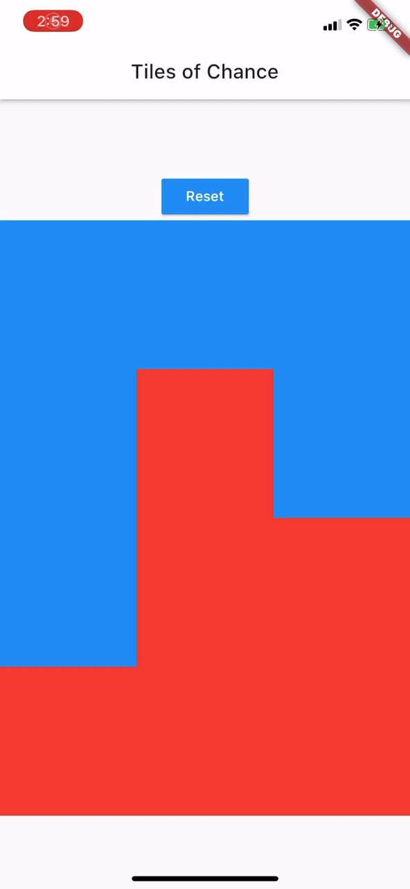

# tiles_of_chance

A simple game of chance using tiles.

Among the grid of colored tiles, there is one tile that hides a monster. Don't tap on the monster!

Easily reset with the "reset" button to start over.

## Description

This project is a simple learning activity to better understand concepts in flutter.
1) State management within a widget
2) State management between widgets (parent to children and children to parent)
3) Layout characteristics with rows and columns
4) Visual interactivity with InkWell

